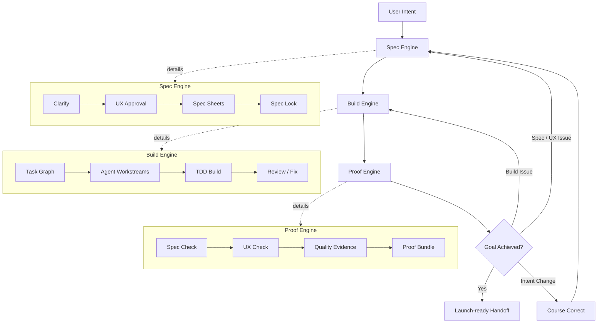

# Lodestar

**Turn a rough idea into a clear product direction, a preview, and a finished build with AI.**

Lodestar is for people who want to make a product with AI without getting lost
in technical decisions. You describe the idea. Lodestar helps shape it, shows
you what it is about to build, then coordinates the agents that implement,
test, review, and hand it back with proof.

The main command is intentionally small:

```text
/lodestar [what you want to make]
```

Examples:

```text
/lodestar make a simple CRM for solo consultants
/lodestar build a cafe pre-order page with an admin view
/lodestar turn my book tracking idea into a web app
```

If you do not want to answer every product question, say:

```text
use your recommendations
```

Lodestar will keep going and only stop for choices that matter: cost, risk,
hard-to-undo changes, and approval of the product preview.

## What Happens

You do not need to understand the internal workflow. In normal use, Lodestar
does six things:

1. Clarifies the idea in plain language.
2. Turns vague direction into concrete product choices.
3. Opens a wireframe preview so you can approve the structure and flow.
4. Helps choose the design system direction, then creates an AI-readable
   `DESIGN.md` with benchmarks and release-quality criteria, then opens a
   design preview catalog.
5. Opens the final UI/UX preview only after mobile, tablet, and desktop
   responsive evidence plus visual QA record a pass.
6. Builds, tests, fixes, reviews, and hands back the product with evidence that
   it works.

Nothing is implemented until you approve the final UI/UX preview.

For browser-rendered web previews, Lodestar treats responsiveness as a matrix,
not a late polish pass: mobile, tablet, and desktop browser evidence are
aggregated into `responsive-matrix.json`, and final UI/UX approval is blocked
until that matrix passes.

## Architecture At A Glance

Lodestar is not a one-way code generator. It is a spec-locked product
development loop: every failure routes back to the right layer before the
product is handed off.



The important control point is the spec lock. Lodestar completes the product,
UX, data, edge-case, QA, and release-readiness specs before execution starts;
then implementation agents work against scoped tasks and proof gates until the
result matches the approved goal.

## What You Decide

Lodestar should only ask you product questions:

- Who is this for?
- What should the first version include?
- Which trade-off feels right?
- Does this wireframe structure match what you meant?
- Which design direction should the product use?
- Does the final UI/UX preview feel ready to build?
- Is a proposed change still the product you approved?

It should not ask you to manage technical project plumbing. Those details stay
inside Lodestar.

## Guided Or Express

At the start, Lodestar asks how involved you want to be:

- **Guided**: Lodestar checks important product decisions with you.
- **Express**: Lodestar uses its recommended choices and only pauses when your
  approval is genuinely needed.

Use Express when you want momentum. Use Guided when you are still exploring the
idea and want to steer more actively.

## Install

### Claude Code

```text
/plugin marketplace add builder-seoro/lodestar
/plugin install lodestar@lodestar
```

Then run:

```text
/lodestar build me a waitlist site with email capture and an admin view
```

### OpenAI Codex

Clone the plugin:

```bash
git clone https://github.com/builder-seoro/lodestar.git ~/.codex/plugins/lodestar
```

Then ask Codex:

```text
Use Lodestar to take this idea from rough direction to finished product: [your idea]
```

## Local Engine Commands

Most users do not need these. They are for validating the workflow engine from a
checkout.

```bash
python scripts/lodestar.py --help
python scripts/lodestar.py dry-run --out ./.lodestar/dry-run
python scripts/lodestar.py negative-checks
```

After installing the package locally:

```bash
pip install -e .
lodestar dry-run --out ./.lodestar/dry-run
```

## For Maintainers

Lodestar is built from a set of workflow skills plus a small Python engine under
`src/lodestar`. The engine validates run artifacts, enforces the order of work,
blocks unsafe handoffs, and makes sure required checks are not skipped.

For the full internal architecture, see
`references/completeness-first-architecture.md`.

## Vendored References

Lodestar adapts selected ideas and reference material from:

- Spec Kit
- Superpowers
- Compound Engineering
- gstack

Vendored files live under `third_party/upstream/`, with attribution in
`NOTICE.md`.

## License

MIT. Vendored portions remain under their original licenses.
