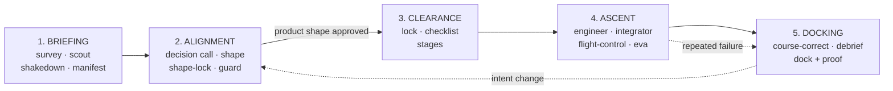

# Lodestar

**Approve the product shape before agents write a line of code.**

[](LICENSE)
[](#install)
[](#install)

Lodestar is a completeness-first, UX-first **AI development delegation harness**.
It lets a non-developer hand a full, ship-grade build to AI agents — and still
stay in control, because the agents must lock a detailed spec and get your
approval on the product shape **before** they implement anything.

It is not a vibe-coding loop. It is a gated pipeline that composes four
battle-tested workflows — [Spec Kit](https://github.com/github/spec-kit),
[Superpowers](https://github.com/obra/superpowers),
[Compound Engineering](https://github.com/EveryInc/compound-engineering-plugin),
and [gstack](https://github.com/garrytan/gstack) — into one contract-enforced
flow with a deterministic safety engine underneath.

## Why

Hand a vague request to an agent and you get drift: it builds the wrong thing,
confidently. Lodestar removes drift by front-loading the decisions:

- **You only decide what a non-coder can decide.** Product trade-offs, the look
  of the interface, and changes that alter intent. Never worktree mechanics or
  schema details.
- **Nothing is built until the spec is locked and the product shape is approved.**
- **Every phase has a gate** that a Python engine enforces — agents cannot skip
  steps, a reviewer cannot quietly edit code, and nothing ships without proof.

## What you see vs. what the agents do

| You are asked to approve | Agents handle silently |
| --- | --- |
| Decision cards (real product trade-offs) | Subagent routing, review persona selection |
| The UX preview, before any code | Worktree isolation, TDD, debugging |
| Amendments that change the locked spec | Schema, validator, and runner-state internals |
| The final handoff, with proof | Mechanical implementation choices |

## How it works

Your intent is the star. Every phase is a flight gate the agents must clear
before the next — no drift, no skipped steps.



1. **BRIEFING** — interrogate the request (survey, scout, shakedown) and write a
   grounded manifest of intent.
2. **ALIGNMENT** — surface genuine choices as decision calls, then show a preview
   of the chosen interface (web / app / none). **You approve the shape before
   code exists.**
3. **CLEARANCE** — lock the spec only after Spec Kit-style ambiguity and coverage
   checks pass, then break it into stages.
4. **ASCENT** — agents build in parallel isolated worktrees with TDD and
   subagent-driven development. Flight-control reviews; only EVA repairs.
5. **DOCKING** — debrief lessons from repeated failures, then dock the result
   with a proof bundle. No handoff with a failing gate.

## Install

> The commands below assume the GitHub repo is named `lodestar`. If you are
> renaming an existing `driftlock` repo, rename it in **Settings → General →
> Repository name** first — GitHub redirects the old URL automatically.

### Claude Code (recommended)

```
/plugin marketplace add hanseo5/lodestar
/plugin install lodestar@lodestar
```

Then start a run from a single request:

```
/lodestar build me a waitlist site with email capture and an admin view
```

### OpenAI Codex

```bash
git clone https://github.com/hanseo5/lodestar.git ~/.codex/plugins/lodestar
```

Then in Codex, invoke the **Lodestar Mission Control** skill (or ask: "use Lodestar to
take my idea through the full gated workflow").

That's the whole front door. `/lodestar` (or `lodestar-mission-control`) orchestrates
all 20 worker skills and every gate for you — you just answer the product
questions it surfaces.

## Getting started (no coding required)

You do **not** need to write code. The whole experience:

1. **Install once.** Install [Claude Code](https://claude.com/claude-code) (or
   OpenAI Codex), then add Lodestar with the one-line install above.
2. **Say what you want.** Run `/lodestar` and describe your idea in one
   sentence — e.g. _"a waitlist site with email capture and an admin view."_
3. **Pick how hands-on to be.** Lodestar asks: **Guided** (it checks each
   product decision with you) or **Express** (it takes the recommended option
   for you and only stops for anything risky, costly, hard to undo, or the look
   of the product).
4. **Answer a few product questions.** Each one comes with a recommended
   answer — you can always reply _"use your recommendations."_ No technical
   questions.
5. **Approve the look.** Before any code is written, Lodestar shows you a preview
   of the screens. Approve it, or ask for changes.
6. **Get the finished result.** Agents build, test, and review it, then hand it
   back with proof that it works — interrupting you only if a change would alter
   what you approved.

Nothing is built until you approve the product shape, and nothing ships with a
failing check.

## Skills

A single orchestrator (`lodestar-mission-control`) drives 20 first-class worker skills:

- **Discovery** — `lodestar-survey`, `lodestar-scout`, `lodestar-shakedown`, `lodestar-manifest`
- **Decision / UX** — `lodestar-triage`, `lodestar-call`, `lodestar-palette`, `lodestar-shape`, `lodestar-shape-lock`, `lodestar-guard`
- **Lock / Plan** — `lodestar-lock`, `lodestar-checklist`, `lodestar-stages`
- **Execution** — `lodestar-engineer`, `lodestar-integrator`, `lodestar-flight-control`, `lodestar-eva`
- **Delivery** — `lodestar-course-correct`, `lodestar-debrief`, `lodestar-dock`

## Under the hood: the safety engine

The Markdown skills define the agent workflow. The [`lodestar`](src/lodestar)
Python package — **pure standard library, zero third-party dependencies** — is
the deterministic layer that makes the gates real: it validates every artifact
against a JSON [schema](schemas/), checks task coverage, enforces runner
transitions and role safety, and refuses invalid handoffs.

Install the engine CLI (zero deps, so this is instant):

```bash
# one-off run, nothing installed (needs uv)
uvx --from git+https://github.com/hanseo5/lodestar.git lodestar --help

# or install the `lodestar` command for good
uv tool install git+https://github.com/hanseo5/lodestar.git

# or with pip, from a checkout
pip install -e .
```

Then verify the whole pipeline with a deterministic dry run (no API calls), run
from a repo checkout:

```bash
lodestar dry-run --out ./.lodestar/dry-run            # installed command
python -m lodestar dry-run --out ./.lodestar/dry-run  # or as a module
python ./scripts/lodestar.py dry-run --out ./.lodestar/dry-run  # or straight from source
```

The dry run walks the full pipeline and emits every artifact in the contract
below. See [`references/completeness-first-architecture.md`](references/completeness-first-architecture.md)
for the non-negotiable gates, and `lodestar --help` for the full command surface
(`validate`, `spec-gate`, `quality-gate`, `execution-dispatch-batch`,
`ce-synthesize`, and more).

<details>
<summary><b>Artifact contract</b> (what a run produces)</summary>

`manifest.md` · `call.json` · `palette.md` ·
`shape.html` · `shape-lock.md` · `locked-spec.json` · `decision-log.jsonl` ·
`checklist-report.json` · `task-graph.json` · `execution-plan.json` ·
`tasks/<task-id>/state.json` · `build-evidence.json` · `review-report.json` ·
`browser-evidence.json` · `quality-report.json` · `amendment-request.json` ·
`debrief.json` · `debrief-brief.md` · `proof-bundle.json` · `final-handoff.json`

</details>

## Vendored references & attribution

Selected upstream material is vendored under [`third_party/upstream/`](third_party/upstream)
with pinned commits and full attribution in [`NOTICE.md`](NOTICE.md). Upstream
skills are **not** exposed directly — Lodestar exposes only `lodestar-*` skills
and adapts upstream behavior through references, validators, and runner states.

- **Spec Kit** — spec/command templates, setup scripts
- **Superpowers** — brainstorming, planning, worktrees, subagent execution, TDD, debugging, verification
- **Compound Engineering** — code review, debug, proof, browser test, compound learning
- **gstack** — office hours, CEO/engineering/design review, QA, ship, guard, learn

## License

[MIT](LICENSE). Vendored portions remain under their original MIT licenses and
copyrights, recorded in [`NOTICE.md`](NOTICE.md).
