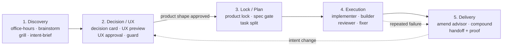

# Driftlock

**Approve the product shape before agents write a line of code.**

[](LICENSE)
[](#install)
[](#install)

Driftlock is a completeness-first, UX-first **AI development delegation harness**.
It lets a non-developer hand a full, ship-grade build to AI agents — and still
stay in control, because the agents must lock a detailed spec and get your
approval on the product shape **before** they implement anything.

It is not a vibe-coding loop. It is a gated pipeline that composes four
battle-tested workflows — [Spec Kit](https://github.com/github/spec-kit),
[Superpowers](https://github.com/obra/superpowers),
[Compound Engineering](https://github.com/EveryInc/compound-engineering-plugin),
and [gstack](https://github.com/garrytan/gstack) — into one contract-enforced
flow with a deterministic safety engine underneath.

## Why

Hand a vague request to an agent and you get drift: it builds the wrong thing,
confidently. Driftlock removes drift by front-loading the decisions:

- **You only decide what a non-coder can decide.** Product trade-offs, the look
  of the interface, and changes that alter intent. Never worktree mechanics or
  schema details.
- **Nothing is built until the spec is locked and the product shape is approved.**
- **Every phase has a gate** that a Python engine enforces — agents cannot skip
  steps, a reviewer cannot quietly edit code, and nothing ships without proof.

## What you see vs. what the agents do

| You are asked to approve | Agents handle silently |
| --- | --- |
| Decision cards (real product trade-offs) | Subagent routing, review persona selection |
| The UX preview, before any code | Worktree isolation, TDD, debugging |
| Amendments that change the locked spec | Schema, validator, and runner-state internals |
| The final handoff, with proof | Mechanical implementation choices |

## How it works



1. **Discovery** — interrogate the request (office hours, brainstorm, grill) and
   write a grounded intent brief.
2. **Decision / UX** — surface genuine choices as decision cards, then show a
   preview of the chosen interface (web / app / none). **You approve the shape
   before code exists.**
3. **Lock / Plan** — lock the spec only after Spec Kit-style ambiguity and
   coverage checks pass, then split it into a task graph.
4. **Execution** — agents implement in parallel isolated worktrees with TDD and
   subagent-driven development. Reviewers review; only fixers fix.
5. **Delivery** — compound lessons from repeated failures, then hand off with a
   proof bundle. No handoff with a failing gate.

## Install

### Claude Code (recommended)

```
/plugin marketplace add hanseo5/driftlock
/plugin install driftlock@driftlock
```

Then start a run from a single request:

```
/driftlock build me a waitlist site with email capture and an admin view
```

### OpenAI Codex

```bash
git clone https://github.com/hanseo5/driftlock.git ~/.codex/plugins/driftlock
```

Then in Codex, invoke the **Driftlock Start** skill (or ask: "use Driftlock to
take my idea through the full gated workflow").

That's the whole front door. `/driftlock` (or `driftlock-start`) orchestrates
all 20 worker skills and every gate for you — you just answer the product
questions it surfaces.

## Skills

A single orchestrator (`driftlock-start`) drives 20 first-class worker skills:

- **Discovery** — `driftlock-office-hours`, `driftlock-brainstorm`, `driftlock-grill`, `driftlock-intent-brief`
- **Decision / UX** — `driftlock-decision-classify`, `driftlock-decision-card`, `driftlock-design-system-lite`, `driftlock-ux-preview`, `driftlock-ux-approval`, `driftlock-ux-guard`
- **Lock / Plan** — `driftlock-product-lock`, `driftlock-spec-gate`, `driftlock-task-split`
- **Execution** — `driftlock-implementer`, `driftlock-builder`, `driftlock-reviewer`, `driftlock-fixer`
- **Delivery** — `driftlock-amend-advisor`, `driftlock-compound`, `driftlock-handoff`

## Under the hood: the safety engine

The Markdown skills define the agent workflow. [`scripts/driftlock.py`](scripts/driftlock.py)
(~4,800 lines, 24 subcommands) is the deterministic layer that makes the gates
real — it validates every artifact against a JSON [schema](schemas/), checks
task coverage, enforces runner transitions and role safety, and refuses invalid
handoffs.

Verify the engine end to end with a deterministic dry run (no API calls):

```bash
# macOS / Linux
python -m pip install -r requirements-dev.txt
python ./scripts/driftlock.py dry-run --out ./.driftlock/dry-run
```

```powershell
# Windows PowerShell
$py = "$env:LOCALAPPDATA\Programs\Python\Python312\python.exe"
& $py .\scripts\driftlock.py dry-run --out .\.driftlock\dry-run
```

The dry run walks the full pipeline and emits every artifact in the contract
below. See [`references/completeness-first-architecture.md`](references/completeness-first-architecture.md)
for the non-negotiable gates, and the README history / `--help` for the full
command surface (`validate`, `spec-gate`, `quality-gate`, `execution-dispatch-batch`,
`ce-synthesize`, and more).

<details>
<summary><b>Artifact contract</b> (what a run produces)</summary>

`intent-brief.md` · `decision-card.json` · `design-system-lite.md` ·
`ux-preview.html` · `ux-lock.md` · `locked-spec.json` · `decision-log.jsonl` ·
`spec-gate-report.json` · `task-graph.json` · `execution-plan.json` ·
`tasks/<task-id>/state.json` · `build-evidence.json` · `review-report.json` ·
`browser-evidence.json` · `quality-report.json` · `amendment-request.json` ·
`ce-synthesis.json` · `ce-brief.md` · `proof-bundle.json` · `final-handoff.json`

</details>

## Vendored references & attribution

Selected upstream material is vendored under [`third_party/upstream/`](third_party/upstream)
with pinned commits and full attribution in [`NOTICE.md`](NOTICE.md). Upstream
skills are **not** exposed directly — Driftlock exposes only `driftlock-*` skills
and adapts upstream behavior through references, validators, and runner states.

- **Spec Kit** — spec/command templates, setup scripts
- **Superpowers** — brainstorming, planning, worktrees, subagent execution, TDD, debugging, verification
- **Compound Engineering** — code review, debug, proof, browser test, compound learning
- **gstack** — office hours, CEO/engineering/design review, QA, ship, guard, learn

## License

[MIT](LICENSE). Vendored portions remain under their original MIT licenses and
copyrights, recorded in [`NOTICE.md`](NOTICE.md).
